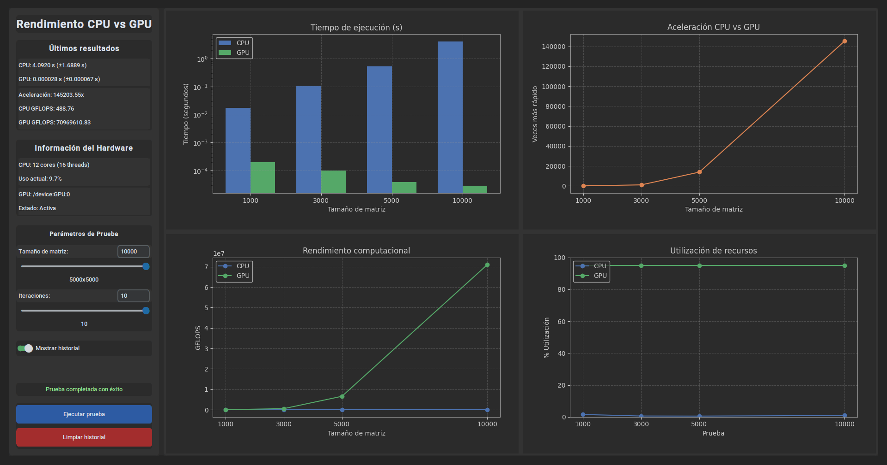

# 🧠 Análisis de Rendimiento CPU vs GPU con Python

<p align="center">
  
</p>

## 🚀 Descripción General

**"Análisis de Rendimiento CPU vs GPU"** es una herramienta interactiva desarrollada en Python que permite comparar el desempeño computacional entre el procesador (CPU) y la tarjeta gráfica (GPU) al ejecutar operaciones intensivas como multiplicaciones de matrices. Diseñada con una interfaz moderna y oscura utilizando `CustomTkinter`, esta aplicación es ideal para entusiastas del rendimiento, estudiantes, docentes o profesionales de la computación que deseen visualizar las diferencias de procesamiento en tiempo real.

---

## 🎯 ¿Qué hace esta aplicación?

La aplicación:

- Multiplica matrices de gran tamaño en CPU y GPU.
- Calcula el tiempo de ejecución para ambos procesadores.
- Mide el rendimiento en **GFLOPS** (Giga Floating Point Operations per Second).
- Visualiza la **aceleración lograda** por la GPU respecto a la CPU.
- Muestra gráficamente los resultados de pruebas anteriores.
- Detecta automáticamente el hardware disponible.

---

## 🖼️ Interfaz Visual

La imagen anterior muestra la interfaz principal de la aplicación. En ella podrás:

- Configurar el **tamaño de la matriz** a procesar.
- Elegir la **cantidad de iteraciones** a realizar.
- Ver en tiempo real el **uso de CPU y GPU**, así como sus estadísticas.
- Ejecutar nuevas pruebas y comparar resultados históricos mediante gráficos.

---

## ⚙️ ¿Cómo funciona?

La aplicación utiliza operaciones de álgebra lineal, específicamente **multiplicación de matrices cuadradas de gran tamaño**, para medir el rendimiento de CPU vs GPU.

### 🔁 Flujo de Ejecución:

1. **Selección de parámetros**: El usuario elige el tamaño de las matrices (`NxN`) y la cantidad de veces que se realizará la prueba.
2. **Ejecución**: Las matrices se multiplican tanto en CPU (usando NumPy) como en GPU (utilizando TensorFlow si está disponible).
3. **Medición**:
   - Se mide el tiempo de ejecución de cada prueba.
   - Se calcula el rendimiento en GFLOPS.
   - Se estima la aceleración lograda por la GPU.
4. **Visualización**: Se actualizan los resultados numéricos y gráficos históricos.

---

## 🔬 Detalles Técnicos

### 📚 Librerías Utilizadas

- `TensorFlow` – Para el uso de la GPU en operaciones de matrices.
- `NumPy` – Procesamiento en CPU.
- `CustomTkinter` – Para construir una interfaz moderna, responsiva y atractiva.
- `Matplotlib` – Visualización de resultados históricos.
- `psutil` – Lectura de estadísticas de hardware en tiempo real.
- `threading` – Para ejecutar procesos sin bloquear la interfaz gráfica.

### 🧠 Operación Matemática Clave

Se comparan operaciones de la forma:

```python
# CPU
A = np.random.rand(N, N).astype(np.float32)
B = np.random.rand(N, N).astype(np.float32)
C_cpu = np.dot(A, B)

# GPU
with tf.device('/GPU:0'):
    A_tf = tf.constant(A)
    B_tf = tf.constant(B)
    C_gpu = tf.matmul(A_tf, B_tf)
